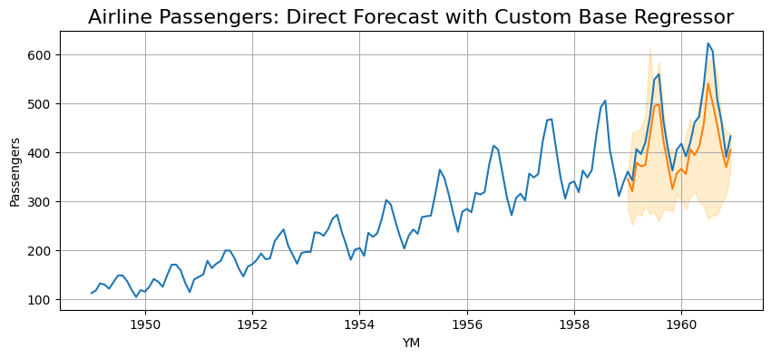

# Using a Custom Base Regressor

In this example, we will use a custom base regressor with the direct forecasting class on the airline passengers dataset.
An XGBoost regressor will be used as it natively supports quantile regression.
However, the custom base regressor class could easily be adapted to work with any algorithm that can support quantile regression (i.e. pinball loss).
This could include neural networks (pytorch or tensorflow), linear regression, or a number of other model types.

---

## Data Preparation

```python
# import airline passenger data 
from clustercast.datasets import load_airline_passengers
airline_data = load_airline_passengers()
airline_data['ID'] = 1
print(airline_data)

# only keep data before 1959 for training
airline_data_train = airline_data.loc[
    airline_data['YM'] < dt.datetime(year=1959, month=1, day=1)
]
```

```profile
            YM  Passengers  ID
0   1949-01-01         112   1
1   1949-02-01         118   1
2   1949-03-01         132   1
3   1949-04-01         129   1
4   1949-05-01         121   1
..         ...         ...  ..
139 1960-08-01         606   1
140 1960-09-01         508   1
141 1960-10-01         461   1
142 1960-11-01         390   1
143 1960-12-01         432   1

[144 rows x 3 columns]
```

```python
# plot the airline data
fig, ax = plt.subplots(figsize=(10, 4));
sns.lineplot(data=airline_data, x='YM', y='Passengers', ax=ax);
ax.grid(axis='both');
ax.set_title('Airline Passengers', fontsize=16);
```


---

## Create a Custom Base Regressor

In this step, we create a custom regressor class that has the following properties:

- An "alpha" argument during instantiation that defines the quantile for prediction (defaults at 0.50, equivalent to Mean Absolute Error)
- A standard Scikit-Learn compatible fit method
- A standard Scikit-Learn compatible predict method

This class is essentially a wrapper around `XGBRegressor` that allows us to pass the quantile regression parameters through the instantiation arguments.
It is apparent that this class could be modified to support essentially any ML algorithm.

```python
# creating a wrapper for custom base regressor using XGBoost
class CustomRegressor():
    # provide the quantile as an argument ("alpha") when instantiating
    def __init__(self, alpha=0.5):
        # create a custom XGBoost regressor using pinball loss with a specified quantile
        self.regressor = XGBRegressor(
            objective='reg:quantileerror', 
            quantile_alpha=alpha, # uses the "alpha" from class instantiation
            n_estimators=300,
            max_depth=8,
            learning_rate=0.05,
            reg_lambda=0.05
        )

    # standard Scikit-Learn fit method
    def fit(self, X, y):
        self.regressor.fit(X, y)
        return self 
    
    # standard Scikit-Learn predict method
    def predict(self, X, y=None):
        return self.regressor.predict(X)
```

---

## Direct Forecaster

Now, let's create a direct forecaster with our custom base regressor class.
The parameters of the `DirectForecaster` are similar to the other examples, with the exception that we pass our
`CustomRegressor` class to the `base_regressor` argument when we create the model.

```python
# define the model
model = DirectForecaster(
    data=airline_data_train,
    endog_var='Passengers',
    id_var='ID',
    timestep_var='YM',
    group_vars=[],
    exog_vars=[],
    boxcox=0,
    differencing=True,
    lags=12,
    seasonality_ordinal=[12],
    base_regressor=CustomRegressor # pass the CustomRegressor class created earlier
)

# fit the model with a 90% prediction interval
# 24 lookahead models, and automatically calculates CQR calibration set size
model.fit(max_steps=24, alpha=0.10, cqr_cal_size='auto')

# make predictions out to 2 years ahead
direct_preds = model.predict(steps=24)

# display some predictions
print(direct_preds.head())
```

```profile
   ID         YM    Forecast  Forecast_0.050  Forecast_0.950
0   1 1959-01-01  344.578409      282.426612      355.635304
1   1 1959-02-01  319.566975      251.435909      438.184587
2   1 1959-03-01  378.031777      275.022579      442.401312
3   1 1959-04-01  370.820691      270.167072      448.559809
4   1 1959-05-01  373.634456      289.659967      476.273913
```

```python
# display the predictions, including the prediction intervals
fig, ax = plt.subplots(figsize=(10, 4));
sns.lineplot(data=airline_data, x='YM', y='Passengers', ax=ax);
sns.lineplot(data=direct_preds, x='YM', y='Forecast', ax=ax);
ax.grid(axis='both');
ax.set_title('Airline Passengers: Direct Forecast', fontsize=16);
ax.fill_between(x=direct_preds['YM'], y1=direct_preds.iloc[:, -2], y2=direct_preds.iloc[:, -1], alpha=0.2, color='orange');
```

