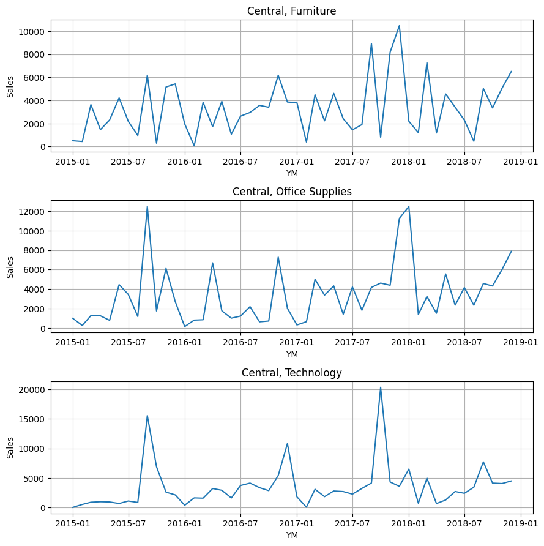

# Modeling with Exogenous Features

In this example, we will use a stores sales dataset to perform a global (multi-series) forecast.
The dataset represents sales for different store region and product category combinations from a single store chain over time.
There are 12 different time series, each with a different combo of region and category (e.g. East Region Furniture Sales or West Region Technology Sales).
A global forecasting model trains on all time series simultaneously.
Global models can draw parallels across all time series, whereas the single-series models are siloed to only one.
For example, in this case, a global model will be able to understand shared trends between all different product categories in a single region.
Similarly, it will also understand shared trends across all regions for a single product category.
We will walk through data preparation, then show creation of both recursive and direct forecast models.

---

## Data Preparation

We will start by joining some exogenous data onto the same sales dataset that was used in the Global Forecasting example.
The exogenous dataset contains two new features, both macroeconomic indicators in the US: Unemployment Rate and Consumer Price Index (CPI).

```python
# join the exogenous data onto the store sales data
data = pd.merge(left=sales_data, right=exog_data, how='left', on='YM')
print(data)

# keep only certain data for training
data_train = data.loc[
    data['YM'] < dt.datetime(year=2018, month=1, day=1)
]
```

```profile
     ID         YM   Region         Category      Sales  Unemployment Rate       CPI
0     1 2015-01-01  Central        Furniture    506.358                5.7  1.947530
1     2 2015-01-01  Central  Office Supplies    996.408                5.7  1.947530
2     3 2015-01-01  Central       Technology     31.200                5.7  1.947530
3     4 2015-01-01     East        Furniture    199.004                5.7  1.947530
4     5 2015-01-01     East  Office Supplies    112.970                5.7  1.947530
..   ..        ...      ...              ...        ...                ...       ...
568   8 2018-12-01    South  Office Supplies   5108.690                3.9  2.911777
569   9 2018-12-01    South       Technology   4515.764                3.9  2.911777
570  10 2018-12-01     West        Furniture  12362.431                3.9  2.911777
571  11 2018-12-01     West  Office Supplies   9225.140                3.9  2.911777
572  12 2018-12-01     West       Technology   8064.524                3.9  2.911777

[573 rows x 7 columns]
```

We will display only the first 3 time series (of the 12 total) for brevity.

```python
# display the first 3 time series
fig, ax = plt.subplots(3, 1, figsize=(9, 9))
ax = np.ravel(ax)
for i in range(3):
    ts_known = data.loc[data['ID'] == i + 1]
    sns.lineplot(data=ts_known, x='YM', y='Sales', ax=ax[i])
    ax[i].grid(axis='both')
    ax[i].set_title(f'{ts_pred['Region'].iloc[0]}, {ts_pred['Category'].iloc[0]}')

fig.tight_layout(pad=1)
```



---

## Direct Forecaster

Now, let's create a direct forecaster.
We will use similar model parameters to those in the Global Forecasting example.
This time, we will also include Unemployment Rate and CPI as exogenous features when we instantiate the model.
For a direct forecaster, that is the only thing you need to do for modeling exogenous features!

```python
# create the forecasting model
model = DirectForecaster(
    data=data_train,
    endog_var='Sales',
    id_var='ID',
    group_vars=['Region', 'Category'],
    exog_vars=['Unemployment Rate', 'CPI'], # include exog features
    timestep_var='YM',
    lags=12,
    seasonality_ordinal=[12],
)

# fit the model
model.fit(max_steps=12, alpha=0.10, cqr_cal_size='auto')

# make predictions
direct_preds = model.predict(steps=12)
print(direct_preds)
```

```profile
     ID         YM   Region         Category     Forecast  Forecast_0.050  Forecast_0.950
0     1 2018-01-01  Central        Furniture  3263.294564      732.286329    11748.444901
1     2 2018-01-01  Central  Office Supplies  2794.477492      208.984567    12961.443208
2     3 2018-01-01  Central       Technology  4380.098196      797.547269    21857.918680
3     4 2018-01-01     East        Furniture  3729.807853     1296.053621     9192.842472
4     5 2018-01-01     East  Office Supplies  4218.281820     2291.741176    11076.653250
..   ..        ...      ...              ...          ...             ...             ...
139   8 2018-12-01    South  Office Supplies  5887.928413     1277.627392     5035.407014
140   9 2018-12-01    South       Technology  4424.659682      898.589906    10710.782462
141  10 2018-12-01     West        Furniture  9069.307202     1818.777556    14607.406334
142  11 2018-12-01     West  Office Supplies  8040.104658     1916.935088    15490.695424
143  12 2018-12-01     West       Technology  7740.399938     1768.470532    18257.377666

[144 rows x 7 columns]
```

```python
# display the first 3 time series forecasts
fig, ax = plt.subplots(3, 1, figsize=(9, 9))
ax = np.ravel(ax)
for i in range(3):
    ts_known = data.loc[data['ID'] == i + 1]
    ts_pred = direct_preds.loc[direct_preds['ID'] == i + 1]
    sns.lineplot(data=ts_known, x='YM', y='Sales', ax=ax[i])
    sns.lineplot(data=ts_pred, x='YM', y='Forecast', ax=ax[i])
    ax[i].grid(axis='both')
    ax[i].fill_between(x=ts_pred['YM'], y1=ts_pred.iloc[:, -2], y2=ts_pred.iloc[:, -1], alpha=0.2, color='orange')
    ax[i].set_title(f'{ts_pred['Region'].iloc[0]}, {ts_pred['Category'].iloc[0]}')

fig.tight_layout(pad=1)
```


---

## Recursive Forecaster

For recursive forecasting models, you need to also pass future values of the exogenous variables to the prediction method.
These future values may either be forecasted themselves or they may be known a-priori (e.g. what-if scenario modeling, or factors that are controlled by you).
The reason that future values must be passed to the predict method is because recursive models only predict one step ahead, then feed
those new predictions as inputs for the prediction for the next step ahead. 
The recursive model only makes predictions for the endogenous variable (not the exogenous ones) so they must be passed to the predict method.

We will start by preparing the exogenous dataframe that will be passed to the predict method. 
This dataframe must have the following columns:

- The timestep
- The series ID
- The exogenous variable values for the corresponding timestep and series ID

Because we joined the Unemployment Rate and CPI data to the original store sales dataset, we can just isolate the relevant columns from that dataframe.

```python
# get the exogenous feature values out to the end of the forecast horizon
future_exog = data[['ID', 'YM', 'Unemployment Rate', 'CPI']].copy()
print(future_exog)
```

```profile
     ID         YM  Unemployment Rate       CPI
0     1 2015-01-01                5.7  1.947530
1     2 2015-01-01                5.7  1.947530
2     3 2015-01-01                5.7  1.947530
3     4 2015-01-01                5.7  1.947530
4     5 2015-01-01                5.7  1.947530
..   ..        ...                ...       ...
568   8 2018-12-01                3.9  2.911777
569   9 2018-12-01                3.9  2.911777
570  10 2018-12-01                3.9  2.911777
571  11 2018-12-01                3.9  2.911777
572  12 2018-12-01                3.9  2.911777

[573 rows x 4 columns]
```

Now, let's create a recursive forecaster model.
We will use the same parameters as we did with the direct forecaster.
Notice that the future exogenous data is passed to the predict method, also.

```python
# create the forecasting model
model = RecursiveForecaster(
    data=data_train,
    endog_var='Sales',
    id_var='ID',
    group_vars=['Region', 'Category'],
    exog_vars=['Unemployment Rate', 'CPI'], # include exog features
    timestep_var='YM',
    lags=12,
    seasonality_ordinal=[12],
)

# fit the model
model.fit(alpha=0.10)

# make predictions, and include the exogenous feature data
recursive_preds = model.predict(steps=12, exog_data=future_exog)
print(recursive_preds)
```

```profile
     ID         YM   Region         Category     Forecast  Forecast_0.050  Forecast_0.950
0     1 2018-01-01  Central        Furniture  3263.294564     1779.689714     4908.194980
1     2 2018-01-01  Central  Office Supplies  2794.477492     1313.254393     6970.375753
2     3 2018-01-01  Central       Technology  4380.098196     3260.778271    14669.811855
3     4 2018-01-01     East        Furniture  3729.807853     2191.461063     9860.048448
4     5 2018-01-01     East  Office Supplies  4218.281820     2928.411646     6790.490721
..   ..        ...      ...              ...          ...             ...             ...
139   8 2018-12-01    South  Office Supplies  5018.833178     3988.594937     7203.783553
140   9 2018-12-01    South       Technology  3888.920668     2810.779046     5496.608605
141  10 2018-12-01     West        Furniture  7410.047095     6460.794269    10364.639827
142  11 2018-12-01     West  Office Supplies  7315.177064     5624.461468     9089.341806
143  12 2018-12-01     West       Technology  7628.612253     6590.594292    11078.375500

[144 rows x 7 columns]
```

```python
# display the first 3 time series forecasts
fig, ax = plt.subplots(3, 1, figsize=(9, 9))
ax = np.ravel(ax)
for i in range(3):
    ts_known = data.loc[data['ID'] == i + 1]
    ts_pred = recursive_preds.loc[recursive_preds['ID'] == i + 1]
    sns.lineplot(data=ts_known, x='YM', y='Sales', ax=ax[i])
    sns.lineplot(data=ts_pred, x='YM', y='Forecast', ax=ax[i])
    ax[i].grid(axis='both')
    ax[i].fill_between(x=ts_pred['YM'], y1=ts_pred.iloc[:, -2], y2=ts_pred.iloc[:, -1], alpha=0.2, color='orange')
    ax[i].set_title(f'{ts_pred['Region'].iloc[0]}, {ts_pred['Category'].iloc[0]}')

fig.tight_layout(pad=1)
```

