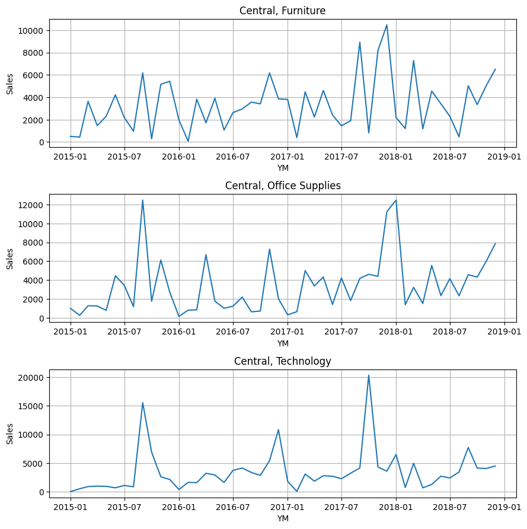
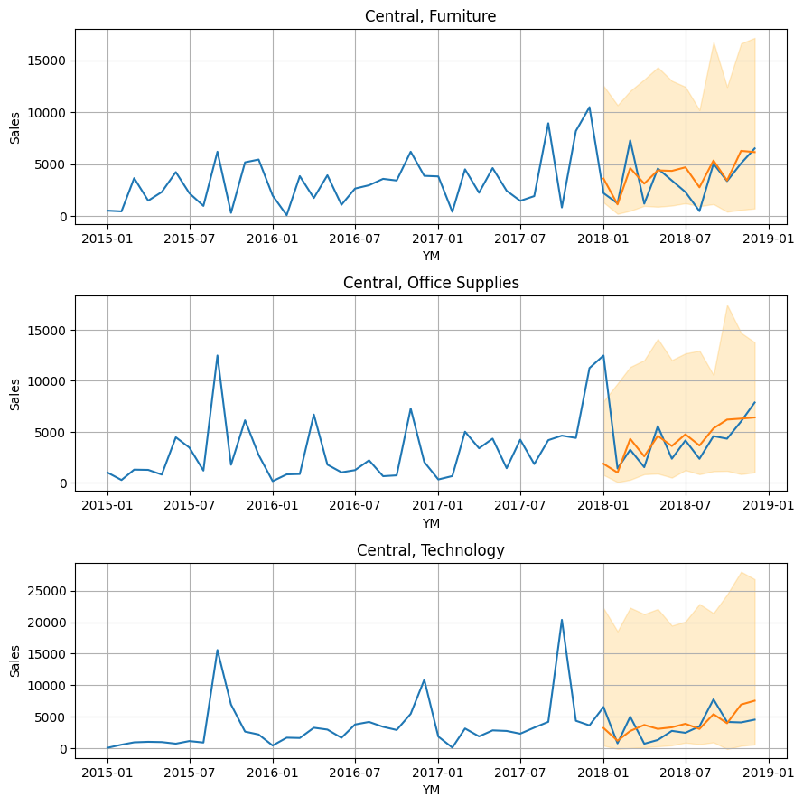
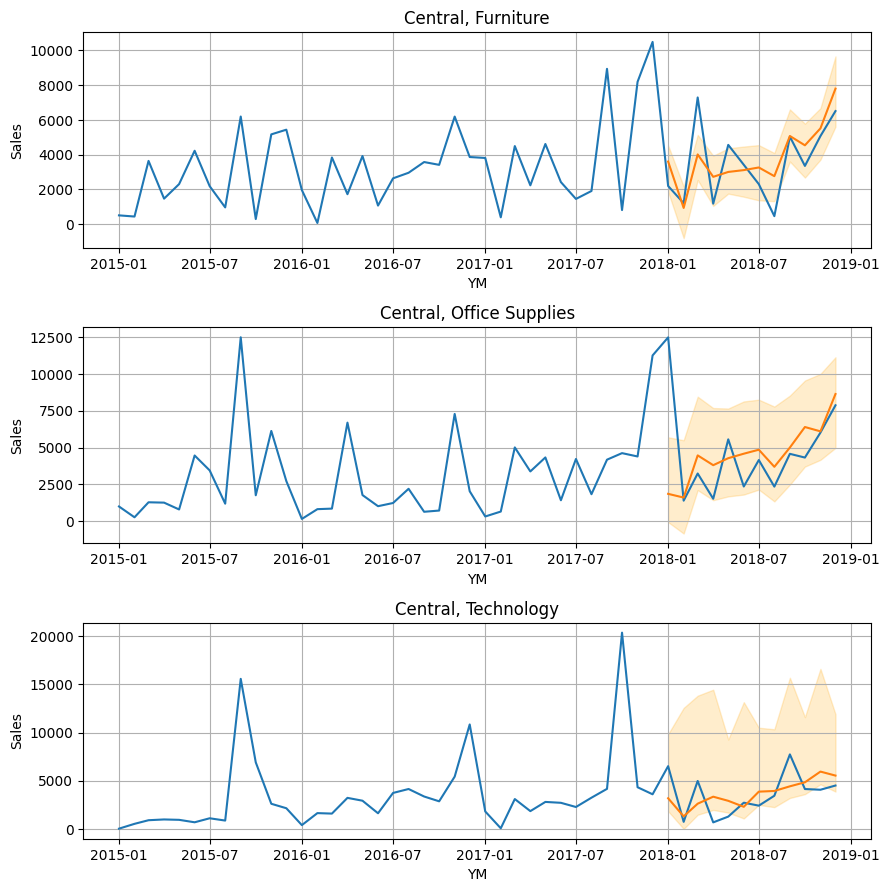

# Global (Multi-Series) Forecasting

In this example, we will use a stores sales dataset to perform a global (multi-series) forecast.
The dataset represents sales for different store region and product category combinations from a single store chain over time.
There are 12 different time series, each with a different combo of region and category (e.g. East Region Furniture Sales or West Region Technology Sales).
A global forecasting model trains on all time series simultaneously.
Global models can draw parallels across all time series, whereas the single-series models are siloed to only one.
For example, in this case, a global model will be able to understand shared trends between all different product categories in a single region.
Similarly, it will also understand shared trends across all regions for a single product category.
We will walk through data preparation, then show creation of both recursive and direct forecast models.

---

## Data Preparation

```python
# imports
from clustercast.datasets import load_store_sales
from clustercast import DirectForecaster, RecursiveForecaster

# load store sales data
data = load_store_sales()
print(data)

# keep only certain data for training
data_train = data.loc[
    data['YM'] < dt.datetime(year=2018, month=1, day=1)
]
```

```profile
     ID         YM   Region    Category     Sales
0     1 2015-01-01  Central   Furniture   506.358
1     1 2015-02-01  Central   Furniture   439.310
2     1 2015-03-01  Central   Furniture  3639.290
3     1 2015-04-01  Central   Furniture  1468.218
4     1 2015-05-01  Central   Furniture  2304.382
..   ..        ...      ...         ...       ...
568  12 2018-08-01     West  Technology  6230.788
569  12 2018-09-01     West  Technology  5045.440
570  12 2018-10-01     West  Technology  4651.807
571  12 2018-11-01     West  Technology  7584.580
572  12 2018-12-01     West  Technology  8064.524

[573 rows x 5 columns]
```

We will display only the first 3 time series (of the 12 total) for brevity.

```python
# display the first 3 time series
fig, ax = plt.subplots(3, 1, figsize=(9, 9))
ax = np.ravel(ax)
for i in range(3):
    ts_known = data.loc[data['ID'] == i + 1]
    sns.lineplot(data=ts_known, x='YM', y='Sales', ax=ax[i])
    ax[i].grid(axis='both')
    ax[i].set_title(f'{ts_pred['Region'].iloc[0]}, {ts_pred['Category'].iloc[0]}')

fig.tight_layout(pad=1)
```



---

## Direct Forecaster

Now, let's create a direct forecaster.
Of the 12 time series, all but 2 of them pass the 0.05 significance threshold for the ADF stationarity test.
Because of this, we will not perform any Box-Cox or differencing transformations to the dataset.
We will use the following modeling parameters:

- 12 lag features (a full year prior)
- Ordinal seasonality feature that is 12 timesteps long
- A sample weight halflife of 12 months
- Custom LightGBM hyperparameters
- Automatic CQR calibration size during the model fit

```python
# create the forecasting model
model = DirectForecaster(
    data=data_train,
    endog_var='Sales',
    id_var='ID',
    group_vars=['Region', 'Category'],
    timestep_var='YM',
    lags=12,
    sample_weight_halflife=12,
    seasonality_ordinal=[12],
    lgbm_kwargs={'n_estimators': 300, 'learning_rate': 0.03, 'max_depth': 30, 'reg_lambda': 0.03, 'verbose':-1},
)

# check stationarity
print(model.stationarity_test(test='adf'))

# fit the model
model.fit(max_steps=12, alpha=0.10, cqr_cal_size='auto')

# make predictions
direct_preds = model.predict(steps=12)
print(direct_preds)
```

```profile
    ID  Raw ADF p-value  Transformed ADF p-value
0    1     3.024806e-06             3.024806e-06
1    2     9.720171e-06             9.720171e-06
2    3     4.743699e-05             4.743699e-05
3    4     4.770512e-05             4.770512e-05
4    5     3.168263e-01             3.168263e-01
5    6     2.386381e-03             2.386381e-03
6    7     7.037006e-10             7.037006e-10
7    8     5.054659e-08             5.054659e-08
8    9     1.703273e-07             1.703273e-07
9   10     9.025448e-03             9.025448e-03
10  11     6.618927e-02             6.618927e-02
11  12     1.278997e-07             1.278997e-07

     ID         YM   Region         Category     Forecast  Forecast_0.050  Forecast_0.950
0     1 2018-01-01  Central        Furniture  3600.877987     1304.404081    12546.381077
1     2 2018-01-01  Central  Office Supplies  1854.132830      758.713625     7989.223754
2     3 2018-01-01  Central       Technology  3186.816992      373.205139    22228.241521
3     4 2018-01-01     East        Furniture  2012.114413     1355.272540     7146.558209
4     5 2018-01-01     East  Office Supplies  4260.039391     2117.299462    12542.677098
..   ..        ...      ...              ...          ...             ...             ...
139   8 2018-12-01    South  Office Supplies  5695.951009     1421.737462     6650.924945
140   9 2018-12-01    South       Technology  4235.936202     1164.827973    14433.810182
141  10 2018-12-01     West        Furniture  9147.575517     1095.153727    18736.839496
142  11 2018-12-01     West  Office Supplies  7922.622796     1330.612234    15289.648935
143  12 2018-12-01     West       Technology  7706.907351     1524.306079    17297.574709

[144 rows x 7 columns]
```

As shown in the stationarity test results, the Augmented Dickey-Fuller test shows that the p-value for all but 2 of the 
series pass the 0.05 significance threshold. Because the data transformations must apply the same to all series in a global model
and a vast majority of the series are stationary, we will not apply a transformation.
Note that the "raw" and "transformed" p-values in the stationarity test match, since there were not transformations.

```python
# display the first 3 time series forecasts
fig, ax = plt.subplots(3, 1, figsize=(9, 9))
ax = np.ravel(ax)
for i in range(3):
    ts_known = data.loc[data['ID'] == i + 1]
    ts_pred = direct_preds.loc[direct_preds['ID'] == i + 1]
    sns.lineplot(data=ts_known, x='YM', y='Sales', ax=ax[i])
    sns.lineplot(data=ts_pred, x='YM', y='Forecast', ax=ax[i])
    ax[i].grid(axis='both')
    ax[i].fill_between(x=ts_pred['YM'], y1=ts_pred.iloc[:, -2], y2=ts_pred.iloc[:, -1], alpha=0.2, color='orange')
    ax[i].set_title(f'{ts_pred['Region'].iloc[0]}, {ts_pred['Category'].iloc[0]}')

fig.tight_layout(pad=1)
```



---

## Recursive Forecaster

Now, let's create a recursive forecaster model.
We will use the same parameters as we did with the direct forecaster.

```python
# create the forecasting model
model = RecursiveForecaster(
    data=data_train,
    endog_var='Sales',
    id_var='ID',
    group_vars=['Region', 'Category'],
    timestep_var='YM',
    lags=12,
    sample_weight_halflife=12,
    seasonality_ordinal=[12],
    lgbm_kwargs={'n_estimators': 300, 'learning_rate': 0.03, 'max_depth': 30, 'reg_lambda': 0.03, 'verbose':-1},
)

# fit the model
model.fit(alpha=0.10)

# make predictions
recursive_preds = model.predict(steps=12)
print(recursive_preds)
```

```profile
     ID         YM   Region         Category      Forecast  Forecast_0.050  Forecast_0.950
0     1 2018-01-01  Central        Furniture   3600.877987     1862.175399     4532.177408
1     2 2018-01-01  Central  Office Supplies   1854.132830     -649.050239     5697.865943
2     3 2018-01-01  Central       Technology   3186.816992     1846.423599    14436.654395
3     4 2018-01-01     East        Furniture   2012.114413      253.129934     5767.364540
4     5 2018-01-01     East  Office Supplies   4260.039391     2817.869584     7339.969946
..   ..        ...      ...              ...           ...             ...             ...
139   8 2018-12-01    South  Office Supplies   5016.456907     3244.679117     6785.770083
140   9 2018-12-01    South       Technology   3063.623135     1636.479677    10877.299013
141  10 2018-12-01     West        Furniture  10457.080657     8535.693350    13387.175556
142  11 2018-12-01     West  Office Supplies   7680.674792     5173.239341    10100.742047
143  12 2018-12-01     West       Technology   9337.751909     6797.900776    11783.540552

[144 rows x 7 columns]
```

```python
# display the first 3 time series forecasts
fig, ax = plt.subplots(3, 1, figsize=(9, 9))
ax = np.ravel(ax)
for i in range(3):
    ts_known = data.loc[data['ID'] == i + 1]
    ts_pred = recursive_preds.loc[recursive_preds['ID'] == i + 1]
    sns.lineplot(data=ts_known, x='YM', y='Sales', ax=ax[i])
    sns.lineplot(data=ts_pred, x='YM', y='Forecast', ax=ax[i])
    ax[i].grid(axis='both')
    ax[i].fill_between(x=ts_pred['YM'], y1=ts_pred.iloc[:, -2], y2=ts_pred.iloc[:, -1], alpha=0.2, color='orange')
    ax[i].set_title(f'{ts_pred['Region'].iloc[0]}, {ts_pred['Category'].iloc[0]}')

fig.tight_layout(pad=1)
```

