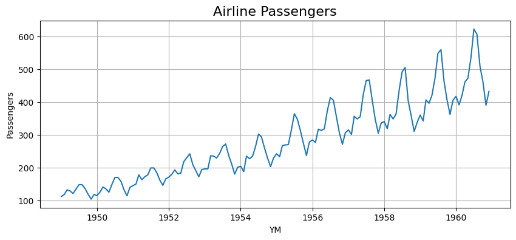
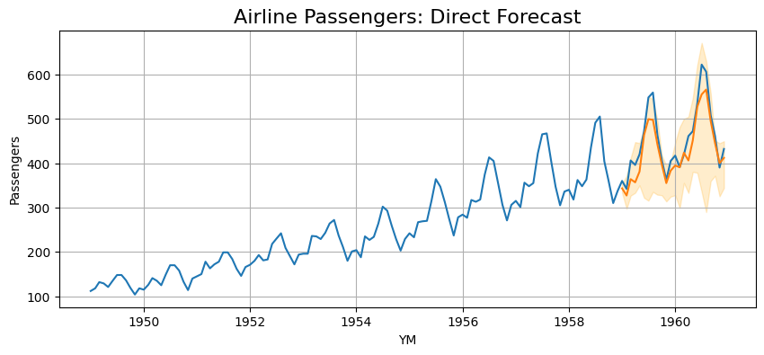
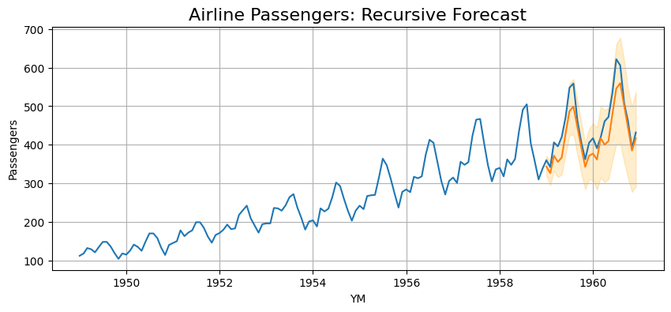

# Local (Single-Series) Forecasting

In this example, we will use the well-known airline passengers dataset to perform a simple single-series forecast.
We will walk through data preparation, then show creation of both recursive and direct forecast models.

---

## Data Preparation

```python
# import airline passenger data 
airline_data = pd.read_csv('airline_passengers.csv', parse_dates=['Month'])
airline_data.columns = ['YM', 'Passengers']
airline_data['ID'] = 1 # only a single series, so all rows have the same ID
print(airline_data)

# only keep data before 1959 for training
airline_data_train = airline_data.loc[
    airline_data['YM'] < dt.datetime(year=1959, month=1, day=1)
]
```

```profile
            YM  Passengers  ID
0   1949-01-01         112   1
1   1949-02-01         118   1
2   1949-03-01         132   1
3   1949-04-01         129   1
4   1949-05-01         121   1
..         ...         ...  ..
139 1960-08-01         606   1
140 1960-09-01         508   1
141 1960-10-01         461   1
142 1960-11-01         390   1
143 1960-12-01         432   1

[144 rows x 3 columns]
```

```python
# plot the airline data
fig, ax = plt.subplots(figsize=(10, 4));
sns.lineplot(data=airline_data, x='YM', y='Passengers', ax=ax);
ax.grid(axis='both');
ax.set_title('Airline Passengers', fontsize=16);
```



---

## Direct Forecaster

Now, let's create a direct forecaster.
Because the time series is non-stationary, we will take the log of the series and then include first order differencing.
We'll also use 12 lag features (a full year prior) and apply an ordinal seasonality feature that is 12 timesteps long.

```python
# define the model
model = DirectForecaster(
    data=airline_data_train,
    endog_var='Passengers',
    id_var='ID',
    timestep_var='YM',
    group_vars=[],
    exog_vars=[],
    boxcox=0,
    differencing=True,
    lags=12,
    seasonality_ordinal=[12],
)

# show stationarity test
print(model.stationarity_test(test='adf'))

# fit the model with a 90% prediction interval
# 24 lookahead models, with 4 years of CQR calibration data
model.fit(max_steps=24, alpha=0.10, cqr_cal_size=48)

# make predictions out to 2 years ahead
direct_preds = model.predict(steps=24)

# display some predictions
print(direct_preds.head())
```

```profile
   ID  Raw ADF p-value  Transformed ADF p-value
0   1         0.826794                 0.158228

   ID         YM    Forecast  Forecast_0.050  Forecast_0.950
0   1 1959-01-01  343.240852      318.309103      356.097399
1   1 1959-02-01  327.078275      291.315758      381.538205
2   1 1959-03-01  363.945743      296.112474      416.552425
3   1 1959-04-01  356.755783      314.271979      450.546157
4   1 1959-05-01  381.087484      333.984742      431.445450
```

As shown in the stationarity test results, the Augmented Dickey-Fuller test shows that the p-value after the data 
transformations is much closer to stationary than before, but it is still not quite passing the significance threshold of 0.05.
That is okay for this example.

```python
# display the predictions, including the prediction intervals
fig, ax = plt.subplots(figsize=(10, 4));
sns.lineplot(data=airline_data, x='YM', y='Passengers', ax=ax);
sns.lineplot(data=direct_preds, x='YM', y='Forecast', ax=ax);
ax.grid(axis='both');
ax.set_title('Airline Passengers: Direct Forecast', fontsize=16);
ax.fill_between(x=direct_preds['YM'], y1=direct_preds.iloc[:, -2], y2=direct_preds.iloc[:, -1], alpha=0.2, color='orange');
```



---

## Recursive Forecaster

Now, let's create a recursive forecaster model.
We will use the same parameters as we did with the direct forecaster.

```python
# define the model
model = RecursiveForecaster(
    data=airline_data_train,
    endog_var='Passengers',
    id_var='ID',
    timestep_var='YM',
    group_vars=[],
    exog_vars=[],
    boxcox=0,
    differencing=True,
    lags=12,
    seasonality_ordinal=[12],
)

# fit the model with a 90% prediction interval
model.fit(alpha=0.10)

# make predictions out to 2 years ahead
recursive_preds = model.predict(steps=24)

# display some predictions
print(recursive_preds.head())
```

```profile
   ID         YM    Forecast  Forecast_0.050  Forecast_0.950
0   1 1959-01-01  343.240852      323.130861      372.400399
1   1 1959-02-01  325.689354      297.579253      356.483323
2   1 1959-03-01  371.489560      333.035457      410.702360
3   1 1959-04-01  356.554110      317.830452      396.871775
4   1 1959-05-01  368.268217      320.869205      411.887196
```

```python
# display the predictions, including the prediction intervals
fig, ax = plt.subplots(figsize=(10, 4));
sns.lineplot(data=airline_data, x='YM', y='Passengers', ax=ax);
sns.lineplot(data=recursive_preds, x='YM', y='Forecast', ax=ax);
ax.grid(axis='both');
ax.set_title('Airline Passengers: Recursive Forecast', fontsize=16);
ax.fill_between(x=recursive_preds['YM'], y1=recursive_preds.iloc[:, -2], y2=recursive_preds.iloc[:, -1], alpha=0.2, color='orange');
```

